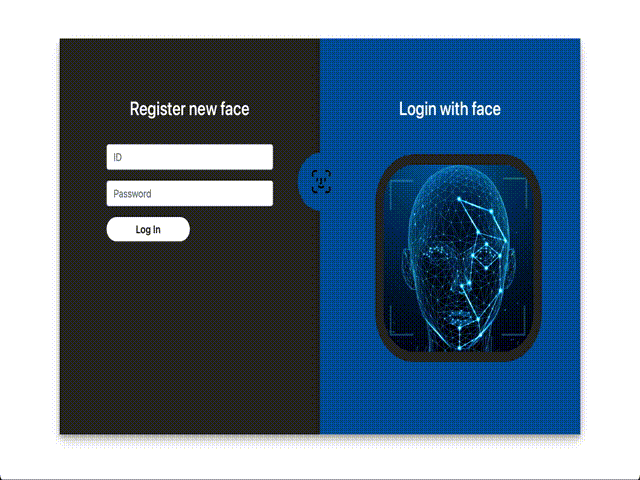
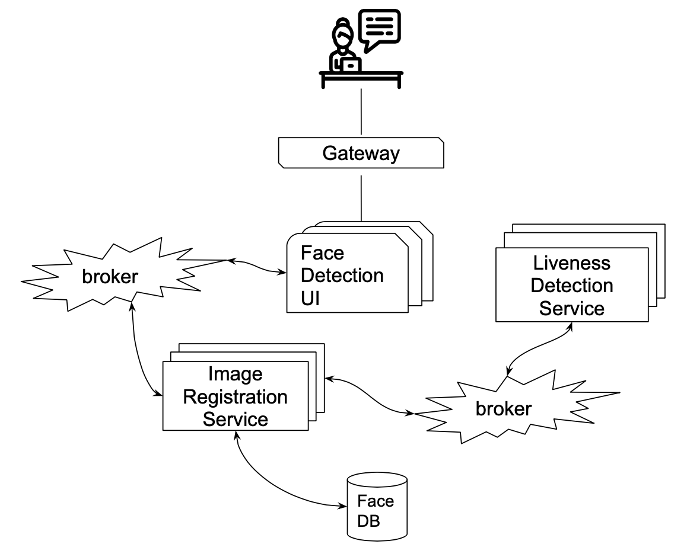
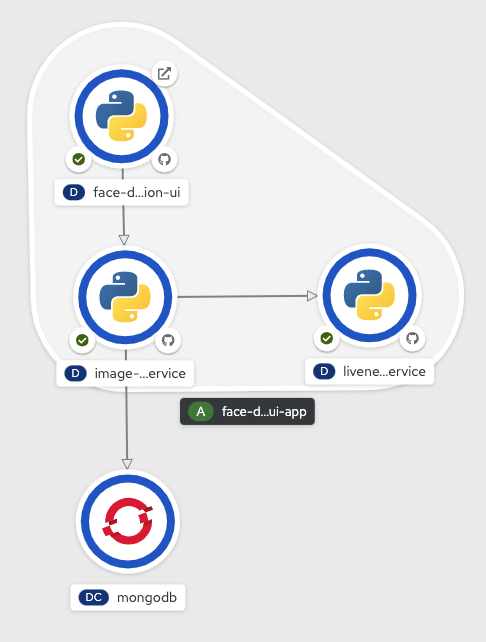

# Who's that Pokemon

This project wants to explore the power of DeepLearning in order to create models for face recognition and liveness detection that can be used for tasks like login on a website. 
For this purpose we propose a webapp that allows a system administrator to register new users using directly their face and gives the ability to login using face recognition. 



## Environment

This project provides a script that setup the environment of the main repository automatically. <br><br>
To create the virtual environment simply run:<br>
```
python env_builder.py
```
this script will create a virtualenv inside `virt/` folder. (This operation may take few minutes) <br><br>
To activate the virtual environment use:<br>
```
. virt/bin/activate
```
To deactivate the virtual environment use:<br>
```
deactivate
```

## Requirements

If you don't use the automatic generated virtual environment or if you're running the code inside the submodules 
you need to install the requirements running:
```
pip install -r requirements.txt
```

## Project Structure

 This project is divided into 2 main blocks
 
####  **Research block:** <br>
A set of jupyter notebook and python modules that are the building block for the research made in this project. All of this belongs to this main repository of the project. Here you'll find:

```bash
.
├── data_visualization.ipynb: 
│			Description:	
│				This notebook has been used to explore the 
│				LFW dataset and visualize some images
├── training.ipynb 
│			Description:	
│				[Add description here]
├── training_2.ipynb 
│			Description:	
│				[Add description here]
├── evaluate.ipynb 
│			Description:	
│				[Add description here]
├── liveness.ipynb 
│			Description:	
│				[Add description here]
└── src/ 
	 │		Description:	
	 │			Folder containing all the python code 
	 │			used by the notebooks
	 ├── evaluation/
	 │		Description:	
	 │			this folder contains all the functions 
	 │			used for the evaluation of the models
	 ├── hyper_tune/
	 │		Description:	
	 │			[Add description here]
	 ├── model/
	 │		Description:	
	 │			To this folder belongs all the
	 │			classes representing a NN or a piece of it
	 ├── modules/
	 │		Description:	
	 │			This folder contains all the 
	 │			LightningDataModule extensions used for
	 │			the training, validation and testing
	 └── tools/
	 		Description:	
	 			A set of tools used for 
	 				- data augmentation
	 				- dataset download and preparation
	 				- evaluation
	 				- image processing
	 				- model related operations

```

####  **Application block:**
The application block consists of all the microservices that compose the final web application accordingly to the following scheme


These services are part of the following submodules:

```bash
.
├── face-detection-UI 
├── image-registration-service
└── liveness_detection_service

```

In order to use the wapplication is important to run them all and the access the UI with a browser

* **Local Deploy:** is possible to run these services locally using the `entry.py` script inside them as described in the apposite README file inside the submodule repository. A dockerfile is also provided but further configuration for the networking are necessary. 
* **Deploy with Openshift** Each submodule comes together with the documentation to configure the deployment on Openshift like the following one



Further informations about these services are provided inside the README in each submodule.


## Dataset 
TODO!!!!
The Data Module takes in input a dataset and generates training,validation and test set. 
Currently the Data Module uses an image transformation that aligns the faces using an affine transformation. 
This can be changed inside `lfw_lightning_data_module` changing the default `FaceAlignTransform(FaceAlignTransform.ROTATION)` to `FaceAlignTransform(FaceAlignTransform.AFFINE)` in order to have the experimental affine transformation. 

