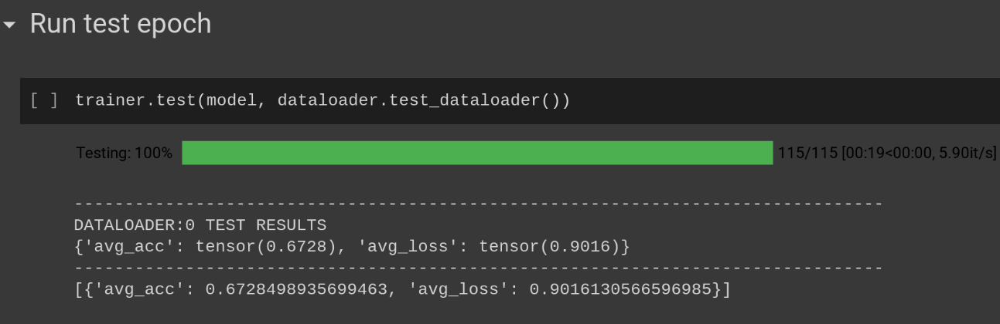
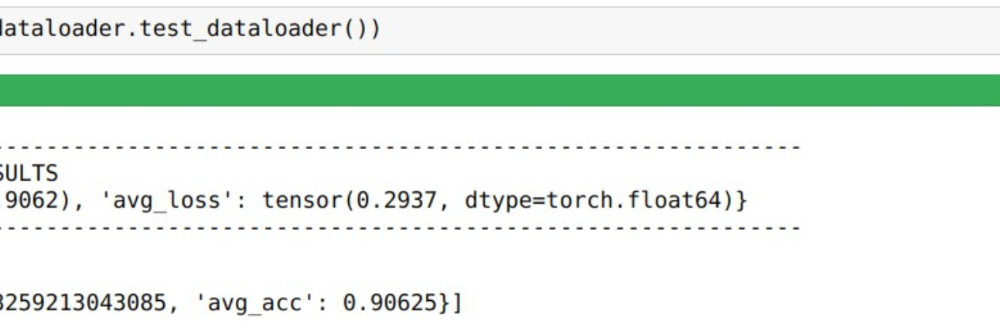
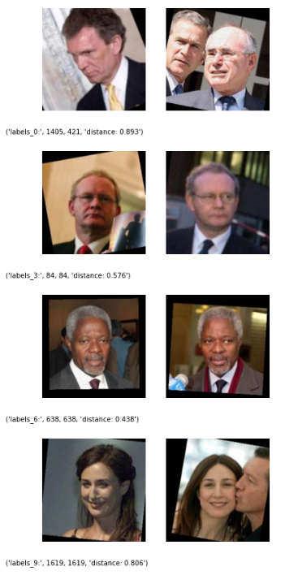
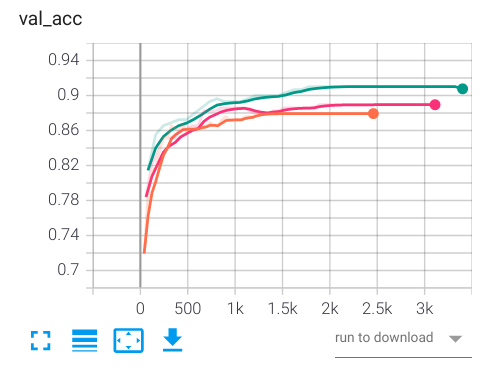
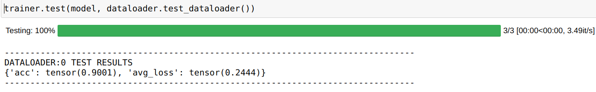
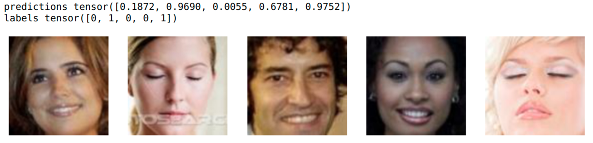

# Who's that Pokemon

## Requirements
install the requirements with:
```pip install -r requirements.txt```

## Download the dataset
The current dataset used is the LFW and can be download from [LFW-People](https://www.kaggle.com/atulanandjha/lfwpeople)

- The dataset can be automatically downloaded with the command `dataset_download_targz()` as shown in the `data_visualization` notebook.

## Dataset data module
The Data Module takes in input a dataset and generates training,validation and test set. 
Currently the Data Module uses an image transformation that aligns the faces using an affine transformation. 
This can be changed inside `lfw_lightning_data_module` changing the default `FaceAlignTransform(FaceAlignTransform.ROTATION)` to `FaceAlignTransform(FaceAlignTransform.AFFINE)` in order to have the experimental affine transformation. 

## Image registration service
The image registration service belongs to his own module under image-registration-service and is used to store the images to a Mongo DB.
Before starting the service is mandatory to configure the credentials in the `credentials.py` file. The credentials for the database are shared in private among the team members. 
Is possible to start up the service typing `python entry.py` inside the module folder.

This service exposes a very simple REST API with 3 methods:

- POST http://127.0.0.1:5000/api/store/<int:employee_id>
	- take as input a JSON of the image data as following:
```
{
	"name":"giovanni",
	"surname":"bartolomeo",
	"img_features":[[float],[float]], 
	"img_base64":"base64 encoded image"
}
```
if the image features are already available is possible to populate the **img_features** int vector, otherwise sending the base64 encoded image, through the **img_base64** string field, the serivce will extract the features on his own and store them on the db. <br>

- POST http://127.0.0.1:5000/api/find_match
	- take a picture as input and return a matching user if any. Is possible to toggle the image cropping system (crops and align the image to the center) and the fraud tedection system.
	- if liveness is true, frames contains 15 base64 pictures used for the liveness detection test
```
{
	"img_crop":bool,
    	"fraud_detection":bool,
	"liveness":bool,
	"img_base64":"base64 encoded image",
	"frames":[string]
}
```

- GET http://127.0.0.1:5000/api/get_all/<page_size>/<page_number>
	- If for example we want to get the first batch of 10 elements from the image list we call `api/get_all/10/1`
	- For the second batch of 10 elements we type `api/get_all/10/2`
- DELETE http://127.0.0.1:5000/api/<employee_id> to delete an entry from the db using the id

## Running the UI
Move inside the ` face-detection-UI ` folder and run the UI with `python entry.py`. This will start the web server at localhost:5006. <br>
In order to upload a new image to the database you must also run the `ìmage-registration-service` on the default 5005 port.  <br><br>
Disclaimer: Don't trust the username & pass login, it is just a demonstrative login with default username "admin" and password "admin". Nothing more than a graphical feature to simulate a system administrator that adds new people to the database.

## Neural Network Models
Three Models are supported for face recognition. The first model, uses a small custom Siamese model and trains it using the contrastive loss. This model is mostly used to test our setup. The second model is also a Siamese model but transfer learning is performed on InceptionResnetV1 CNN pre-trained on vggface2 and uses Bineary Cross Entropy loss instead. The third model uses a Bn-Inception CNN pretrained on ImageNet and trains the model using the Group Loss. We also use an extra model to perform liveness detection before the face recognition stage.

### Siamese Network using Binary Cross Entropy and Contrastive Loss
The train_BCE_Contrastive.ipynb notebook is used to train and evaluate both the Binary Cross Entropy and Contrastive Loss. Some flages and variables, in the notebook, can be used to choose which the behaviour required. For example, to re-run the evluation for the Contrastive Loss (current state), the following should be set throughout the network: 
```
cnn_model = CNN_MODEL.InceptionResnetV1
do_train = False
save_checkpoint = False
load_checkpoint = True
```
We use the accuracy metric to evaluate our models. The accuracy is calculated by counting correctly classified images over the incorrect ones and in this case correctly classified means if they are similar or not. For the Contrastive Loss model, in order to know whether two images are similar or not, we compare the output embeddings to each other by computing the L2 norm and if the value is less than a specific threshold then we label them as equal. In order to find the best threshold we run the evaluation several times to get the threshold that achieves the best accuracy. The final accuracy value is achieved by averaging over batches and epochs.



For the Binary Cross Entropy model the accuracy is simpler to compute since the model outputs a probability of how similar the two images are.



### Group Loss

#### Running the notebook

The Train_Group_Loss.ipynb Notebook is used to train the Group Loss Model. To get the best results, the model was trained on the classification task for 10 epochs before training on the Group Loss which is also the same approach as in the original paper. In addition to that, we tuned the hyper-parameters and used the whole CelebA dataset for training and validation, and LFW for testing.
Similar to the previous model, flags can be used to control the behavior required. For example to evaluate the model on LFW, the following flags throughout the notebook should be set as following:

```python
do_tune = False # we don't want to run hyper-parameter tuning
finetune = False # we don't want to train the model on the classification task.
load_finetune = False # we don't want to load the pre trained model for classification
Load_celeb = False # we don't want to evaluate on the CelebA dataset
do_train = False # we don't want to train the group loss model
load_checkpoint = True # we want to load the pretrained group model checkpoint
do_download = True # to download the dataset
```

In case an older version of Pytorch is available, load_ibm and save_ibm flags can be used to load or save checkpoints across different versions of Pytorch.

Links in the notebook are provided to get all checkpoints used.

#### Algorithm

The Group Loss overcomes the problem of other loss functions such as the contrastive loss and the triplet loss which compare pairs or triplets of images together respectively. That means it is hard to consider all possible combinations. In addition, those loss functions require an extra hyper-parameter (margin) to furthermore separate the embeddings of images corresponding to different persons in the embedding space. On the other hand, the group loss compares all the samples in one batch to each other. It uses a similarity measure as prior information to decide whether to images correspond to the same person or not, and by doing that it learns a clear separation of the embeddings. In other words, the group loss answers the question "given that those two images are x similar to each other, what is the probability of them having the same label?" and it does that for all possible combinations of images in a batch by utilizing the gram matrix.

For the group loss to work, a costume sampler is needed for creating each batch. The sampler chooses n classes with m number of images per class to include in every batch. Choosing n = 24 and m = 2 yields the best results.

#### Evaluation


We use the accuracy metric to evaluate the performance of our algorithm 

Below you can find some visualization of our result where a threshold of 0.85 can label all images correctly:



### Liveness Detection

The liveness detection is used as an extra check to verify whether the person is real or not. It can detect whether a person's eyes are open or closed and with that we can detect if a person blinks which can be added as a requirement on top of the face recognition system. The liveness.ipynb notebook is used to train and evaluate the model. CFW Dataset was used to train the model but since this dataset doesn't contain a lot of images, a couple of tricks needed to be performed. Since we have already trained such a network with the Group Loss model, we were able to use that network with the same trained weights and apply transfer learning to retrain the last classification layer only which brings as to the first trick. For the second trick, we doubled the numbers of training samples by using image augmentation. The effect of image augmentation can be shown in the following graph comparing the three cases where we increased the size of the training set by 1.0, 1.5, and 2.0 for the orange, red and green curves respectively:




​																											*Orange: x1 augmentation*

​																										    *Red: x1.5 augmentation*

​																								 	   	*Green: x2.0 augmentation*

The liveness.ipynb notebook was used to train the model. Similar to the previous notebooks, it is parametrized by various flags that should be set according the required behavior. For example to run the evaluation, the following flags throughout the network set as following:

```
dataset_gdrive_download(config = config_cfw) # uncomment to download CFW Dataset
do_train = False
save_checkpoint = False
load_checkpoint = True
```

The following are the evaluation results:





### Checkpoints

### References
