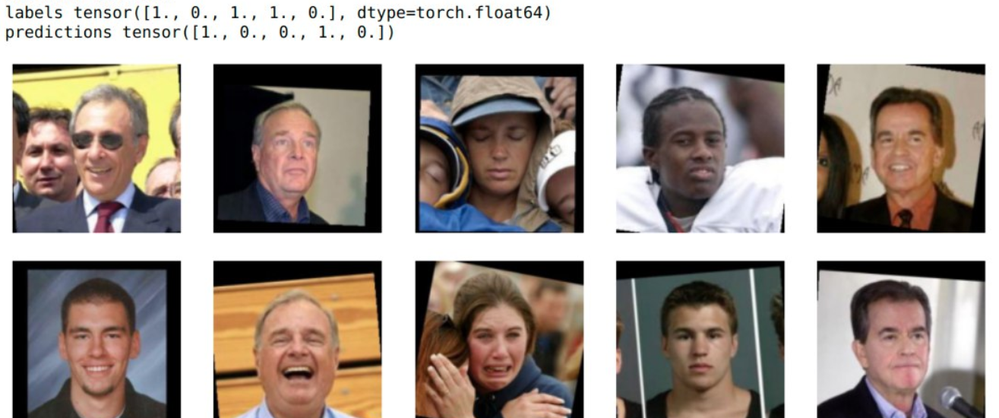
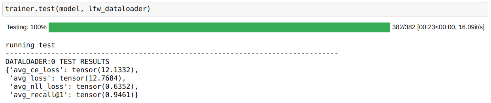
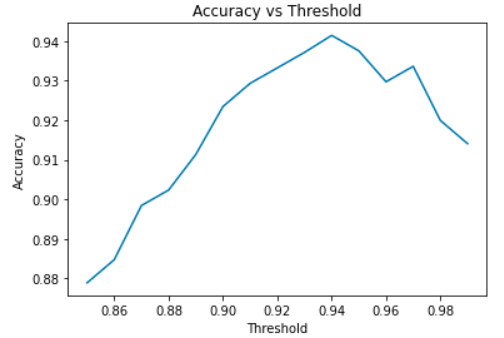
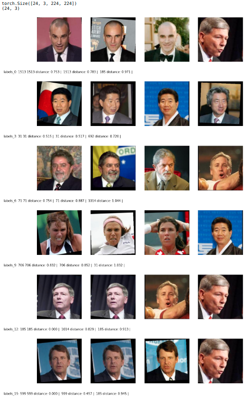

# Who's that Pokemon

This project wants to explore the power of Deep Learning in order to create models for face recognition and liveness detection that can be used for tasks like a website log in. 
For this purpose, we propose a webapp that allows a system administrator to register new users using directly their face and gives the ability to log in using face recognition. Note that this application is not meant to be used for the public the login on the Internet. Rather is more suited for situations like a work environment where the employees have to register the working hours and demonstrate that they're working.


## Environment

This project provides a script that setup the environment of the main repository automatically. <br><br>
To create the virtual environment simply run:

```
python env_builder.py
```

this script will create a virtualenv inside `virt/` folder. (This operation may take few minutes) <br><br>
To activate the virtual environment use:

```
. virt/bin/activate
```

To deactivate the virtual environment use:<br>

```
deactivate
```

## Requirements

If you don't use the automatic generated virtual environment or if you're running the code inside the submodules 
you need to install the requirements manually running:

```
pip install -r requirements.txt
```

## Project Structure

 This project is divided into 2 main blocks

####  **Research block:** <br>
A set of jupyter notebook and python modules that are the building block for the research made in this project. All of this belongs to this main repository. Here you'll find:

```
.
├── data_visualization.ipynb: 
│			Description:	
│				This notebook has been used to explore the 
│				LFW dataset and visualize some images
├── Train_BCE_Contrastive.ipynb 
│			Description:	
│				Used to train and evaluate both the BCE model and the Contrastive Loss model
├── Train_Group_Loss.ipynb 
│			Description:	
│				Used to train and evaluate the Group Loss model
├── evaluate.ipynb 
│			Description:	
│				Evaluation for the contrastive loss model
├── liveness.ipynb 
│			Description:	
│				Used to train the liveness detection model
└── src/ 
	 │		Description:	
	 │			Folder containing all the python code 
	 │			used by the notebooks
	 ├── evaluation/
	 │		Description:	
	 │			this folder contains all the functions 
	 │			used for the evaluation of the models
	 ├── hyper_tune/
	 │		Description:	
	 │			Contains the module used to do hyper-parameter tuning on the Group Loss model
	 ├── model/
	 │		Description:	
	 │			To this folder belongs all the
	 │			classes representing a NN or a piece of it
	 ├── modules/
	 │		Description:	
	 │			This folder contains all the 
	 │			LightningDataModule extensions used for
	 │			the training, validation and testing
	 └── tools/
	 		Description:	
	 			A set of tools used for 
	 				- data augmentation
	 				- dataset download and preparation
	 				- evaluation
	 				- image processing
	 				- model related operations

```

####  **Application block:**
The application block consists of all the microservices that compose the final web application accordingly to the following scheme


These services are part of the following submodules:

```
.
├── face-detection-UI 
├── image-registration-service
└── liveness_detection_service

```

In order to use the web application is important to run them all and the access the UI with a browser

* **Local Deploy:** is possible to run these services locally using the `entry.py` script inside them as described in the apposite README file inside the submodule repository. A dockerfile is also provided but further configuration for the networking are necessary. 
* **Deploy with Openshift** Each submodule comes together with the documentation to configure a deployment on Openshift like the one in the following example


Further informations about these services are provided inside the README in each submodule.


## Datasets 
The datasets used to train, evaluate and test the models are 3:

* CelebA [[4]]([4])
* CEW [[1]]([1])
* LFW [[2]]([2]) [[3]]([3])

They are automatically downloaded through the scripts provided inside `src/tools/dataset_tools.py`, and the download link provided respectively inside `.config_celeba.py`, `.config_cfw.py` and `.config_lfw.py`.

The dataloaders for these datasets can be found inside `src/modules` as Pytorch Lightning data modules. 


## Image Transformation
The images used for the training of the models are all quite uniform thanks to the amazing work made from the creators of these datasets. Anyway when dealing with images taken from the real world we should be very lucky to get images of the same size as the ones from the dataset and also with the same prospective of the subject. In particular, the model always expects an image with fixed width W and height H where W==H and, the face of the subject positioned exactly in the center, with such a rotation that positions the line that connect the eyes exactly parallel to the ground. 
When feeding images from a real world scenario we need a transformation that normalize the size of the picture and positions the subject in a way similar to the one proposed for the used datasets. 

The **FaceAlignTransform** located inside `src/tools/image_preprocessing.py` proposes 2 possible kind of transformation:

* Crop and Rotation
* Simple

The former is the slowest but obtain a result very similar to the images provied by LWD Deep Funneled Datased, the latter is sligthly faster but performs only a crop, assuming that the image is already with th correct rotation. 

### Crop and Rotation Transform

Transform enforced initializing the FaceAlignTransform with the following parameter 

```
transform = FaceAlignTransform(shape=255, kind=FaceAlignTransform.ROTATION)
```

Under the hood this transform performs the following steps:

1. Using MTCNN the algorithm searches for the landmark points and bounding boxes of the face in the picture. If more than one face are detected it takes only into consideration the bounding box with the highest level of confidence.
2. Expand with a factor of 1/3 the bounding box proposed by MTCNN.
3. Create a new black image of size `model_input_shape x model_input_shape`.
4. Fit the extracted face from the expanded bounding box inside the new black picture.
5. Use the landmarks detected by MTCNN to calculate the angle of rotation between the eyes and the X axis and the resulting rotation matrix.
6. Apply the Rotation transformation

### Simple transform

Transform enforced initializing the FaceAlignTransform with the following parameter 

```
transform = FaceAlignTransform(shape=255, kind=FaceAlignTransform.SIMPLE)
```

Very similar to the previous transformation except that:

* Avoid the computation of the landmarks point with MTCNN
* Skip step 5 and 6 

### Example
On the left side the original image captured from a webcam, on the right side the image after that the crop and rotation transform have been applied.


## Neural Network Models
Three Models are supported for face recognition. The first model, uses a small custom Siamese model and trains it using the contrastive loss. This model is mostly used to test our setup. The second model is also a Siamese model but transfer learning is performed on InceptionResnetV1 CNN pre-trained on vggface2 and uses Binary Cross Entropy loss instead. The third model uses a Bn-Inception CNN pre-trained on ImageNet and trains the model using the Group Loss. We also use an extra model to perform liveness detection before the face recognition stage.

### Siamese Network using Binary Cross Entropy and Contrastive Loss

#### Running the notebook

The train_BCE_Contrastive.ipynb notebook is used to train and evaluate both the Binary Cross Entropy and Contrastive Loss. Our work here is inspired by both papers `FaceNet: A unified embedding for face recognition and clustering`[[6]]([6]) and `DeepFace: Closing the Gap to Human-Level Performance in Face Verification`[[7]]([7]). Some flags and variables, in the notebook, can be used to choose which the behavior required. For example, to re-run the evaluation for the Contrastive Loss (current state), the following should be set throughout the network: 
```
cnn_model = CNN_MODEL.InceptionResnetV1
do_train = False
save_checkpoint = False
load_checkpoint = True
```
#### Evaluation

We use the accuracy metric to evaluate our models. The accuracy is calculated by counting correctly classified images over the incorrect ones and in this case correctly classified means if they are similar or not. For the Contrastive Loss model, in order to know whether two images are similar or not, we compare the output embeddings to each other by computing the L2 norm and if the value is less than a specific threshold then we label them as equal. In order to find the best threshold we run the evaluation several times and choose the one with the best accuracy. The final accuracy value is achieved by averaging over batches and epochs.


For the Binary Cross Entropy model the accuracy is simpler to compute since the model outputs a probability of how similar the two images are.


Some examples:



### Group Loss [[5]]([5])

#### Running the notebook

The Train_Group_Loss.ipynb Notebook is used to train the Group Loss Model. To get the best results, the model was trained on the classification task for 10 epochs before training on the Group Loss which is also the same approach as in the original paper. In addition to that, we tuned the hyper-parameters and used the whole CelebA dataset for training and validation, and LFW for testing.
Similar to the previous model, flags can be used to choose the behavior required. For example to evaluate the model on LFW, the following flags throughout the notebook should be set as following:

```python
do_tune = False # we don't want to run hyper-parameter tuning
finetune = False # we don't want to train the model on the classification task.
load_finetune = False # we don't want to load the pre trained model for classification
Load_celeb = False # we don't want to evaluate on the CelebA dataset
do_train = False # we don't want to train the group loss model
load_checkpoint = True # we want to load the pretrained group model checkpoint
do_download = True # to download the dataset
```

In case an older version of Pytorch is available, load_ibm and save_ibm flags can be used to load or save checkpoints across different versions of Pytorch.

Links in the notebook are provided to get all checkpoints used.

#### Algorithm

The Group Loss overcomes the problem of other loss functions such as the contrastive loss and the triplet loss which compare pairs or triplets of images together respectively. That means it is hard to consider all possible combinations. In addition, those loss functions require an extra hyper-parameter (margin) to furthermore separate the embeddings of images corresponding to different persons in the embedding space. On the other hand, the group loss compares all the samples in one batch to each other. It uses a similarity measure as prior information to decide whether to images correspond to the same person or not, and by doing that it learns a clear separation of the embeddings. In other words, the group loss answers the question "given that those two images are x similar to each other, what is the probability of them having the same label?" and it does that for all possible combinations of images in a batch by utilizing the gram matrix.

For the group loss to work, a costume sampler is needed for creating each batch. The sampler chooses n classes with m number of images per class to include in every batch. Choosing n = 24 and m = 2 yields the best results.

#### Evaluation

We use the recall@1 metric to evaluate the performance of our algorithm which is calculated by getting the most similar image to each of the images in the batch and checking if the labels are the same. Summing correctly identified samples and averaging the values over batches and epochs, in case of training, will give us the final result. Nevertheless, the value is strongly related to the number of classes per batch n and number of image per class per patch m. This gives us a clearer analysis of our results. Our final test results on LFW, using n = 8 and m = 3 Dataset are as follows:



We have also calculate the accuracy in the same way on the the same test dataset as in the previous BCE model to compare the performance of both models. Our results are as follows:



The result shows that at a threshold of 0.94 we get 94% accuracy which is around 4% more the the BCE model. Moreover, training this model was much more stable which means it has much less variance.

Below you can find some visualization of our result on the test dataset where a threshold of 0.8 can label all images correctly:



### Liveness Detection

The liveness detection is used as an extra check to verify whether the person is real or not. It can detect whether a person's eyes are open or closed and with that we can detect if a person blinks which can be added as a requirement on top of the face recognition system. The liveness.ipynb notebook is used to train and evaluate the model. The Closed Eyes in the WIld [[1]](#[1]) (CEW) Dataset was used to train the model but since this dataset doesn't contain a lot of images, a couple of tricks needed to be performed. Since we have already trained such a network with the Group Loss model, we were able to use that network with the same trained weights and apply transfer learning to retrain the last classification layer only which brings as to the first trick. For the second trick, we doubled the numbers of training samples by using image augmentation. The effect of image augmentation can be shown in the following graph comparing the three cases where we increased the size of the training set by 1.0, 1.5, and 2.0 for the orange, red and green curves respectively:


​																							*Orange: x1 augmentation*

​																						    *Red: x1.5 augmentation*

​																				 	   	*Green: x2.0 augmentation*

The liveness.ipynb notebook was used to train the model. Similar to the previous notebooks, it is parametrized by various flags that should be set according the required behavior. For example to run the evaluation, the following flags throughout the network set as following:

```
dataset_gdrive_download(config = config_cfw) # uncomment to download CFW Dataset
do_train = False
save_checkpoint = False
load_checkpoint = True
```

The following are the evaluation results:


## Model Zoo

The checkpoints can be found here: https://drive.google.com/drive/folders/1puXPrBrquphElXiCDuZSIbSYdRqprxG0?usp=sharing

| BCE Model                                          | Description                         | Accuracy |
| :------------------------------------------------- | :---------------------------------- | -------- |
| resnet_BCE/Siamese-BCE-epoch=19-val_loss=0.35.ckpt | Train on LFW. No Image Augmentation | 90.16%   |

| Group Loss Model                                             |                                                              | Recall@1 |
| :----------------------------------------------------------- | :----------------------------------------------------------- | -------- |
| group_loss_tuned_2of24_all_data_finetuned/Group-epoch=17-val_loss=1.44-val_R%_@1=81.12.ckpt | Model fine-tuned, hyper-parameter tunned, trained on all of CelebA, and tested on LFW | 94.61%   |
| group_loss_tuned_2of24_all_data/Group-epoch=30-val_loss=1.56-val_R%_@1=79.84.ckpt | Hyper-parameter tunned, trained on CelebA, and tested on LFW | 92.24%   |
| group_loss_tuned_2of24/Group-epoch=24-val_loss=1.53-val_R%_@1=78.84.ckpt | Hyper-parameter tunned, trained and tested on CelebA.        | 91.50%   |

| Liveness Detection Model                                     | Description                            | Accuracy |
| ------------------------------------------------------------ | -------------------------------------- | -------- |
| liveness_all_finetuned/Group-epoch=33-val_acc=0.88.ckpt      | Trained on CEW                         | 88.33%   |
| liveness_all_finetuned_augmented_100%/Group-epoch=25-val_acc=0.91.ckpt | Trained on CEW with Image Augmentation | 90.01%   |


## Citation

### Datasets

<a name="[1]">[1]</a> F.Song, X.Tan, X.Liu and S.Chen, **Eyes Closeness Detection from Still Images with Multi-scale Histograms of Principal Oriented Gradients,** Pattern Recognition, 2014.

<a name="[2]">[2]</a> [Gary B. Huang](http://vis-www.cs.umass.edu/~gbhuang), Manu Ramesh, [Tamara Berg](http://research.yahoo.com/bouncer_user/83), and [Erik Learned-Miller](http://www.cs.umass.edu/~elm). **Labeled Faces in the Wild: A Database for Studying Face Recognition in Unconstrained Environments.** *University of Massachusetts, Amherst, Technical Report 07-49*, October, 2007.

<a name="[3]">[3]</a> [Gary B. Huang](http://vis-www.cs.umass.edu/~gbhuang) and [Erik Learned-Miller](http://www.cs.umass.edu/~elm). **Labeled Faces in the Wild: Updates and New Reporting Procedures.** *University of Massachusetts, Amherst, Technical Report UM-CS-2014-003*, May, 2014.

<a name="[4]">[4]</a> Liu, Z., Luo, P., Wang, X., & Tang, X. (2015). **Deep Learning Face Attributes in the Wild.** In *Proceedings of International Conference on Computer Vision (ICCV)*.

### Models

<a name="[5]">[5]</a> Elezi, I., Vascon, S., Torcinovich, A., Pelillo, M., & Leal-Taixe, L. (2020). **The Group Loss for Deep Metric Learning.** In *European Conference on Computer Vision (ECCV)*.

<a name="[6]">[6]</a> F. Schroff, D. Kalenichenko and J. Philbin, "**FaceNet: A unified embedding for face recognition and clustering,**" 2015 IEEE Conference on Computer Vision and Pattern Recognition (CVPR), Boston, MA, 2015, pp. 815-823, doi: 10.1109/CVPR.2015.7298682.

<a name="[7]">[7]</a> Taigman, Yaniv & Yang, Ming & Ranzato, Marc'Aurelio & Wolf, Lior. (2014). **DeepFace: Closing the Gap to Human-Level Performance in Face Verification.** Proceedings of the IEEE Computer Society Conference on Computer Vision and Pattern Recognition. 10.1109/CVPR.2014.220. 


